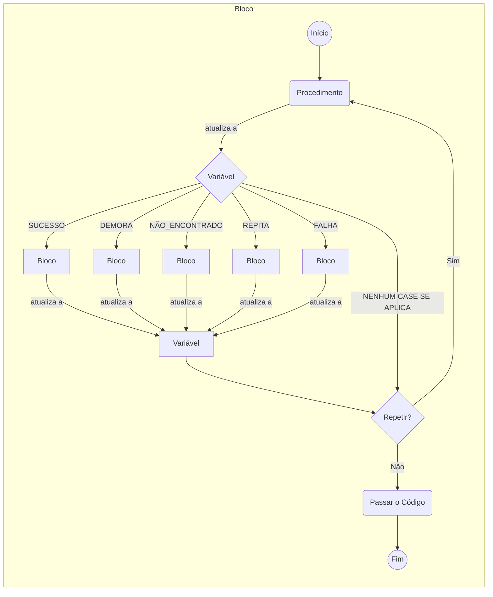

# 🚀 GenJin: Transpilador de Macros

E se seu programa pudesse se autovalidar, garantindo que todos os caminhos de execução possíveis fossem tratados antes mesmo de rodar? GenJin (Gerador Jinja) é um transpilador universal projetado sobre um princípio fundamental: **segurança através da validação estática**.

Ele analisa a árvore de decisões do seu programa em tempo de compilação para garantir que nenhuma condição de saída seja deixada ao acaso. O resultado é um código mais robusto, previsível e autoguiado.

>  **Terminologia**: neste documento, os termos `Bloco`, `Procedimento`, `Variável` e `Código de Saída` correspondem respectivamente a `Block`, `Procedure`, `Variable` e `Output Code` na implementação.

---

## [Visão Geral do GenJin](#genjin)
* [Declaração Geral do Programa](#declaração-geral-do-programa)

---

## [Configurando o Programa](#configurando-o-programa)
* [Lista de Macros](#lista-de-macros)
* [Objeto Programa](#objeto-programa)
---
## [Estrutura de Dados](#estrutura-de-dados)
* [Declaração da Variável](#declaração-da-variável)
    * [Cardinalidade da Variável](#cardinalidade-da-variável)
    * [Tipo da Variável](#tipo-da-variável)
* [Declaração do Procedimento](#declaração-do-procedimento)
    * [Declaração de Parâmetro](#declaração-de-parâmetro)
        * [Cardinalidade do Parâmetro](#cardinalidade-do-parâmetro)
        * [Tipo do Parâmetro](#tipo-do-parâmetro)
        * [Tipo da Avaliação do Parâmetro](#tipo-da-avaliação-do-parâmetro)
    * [Declaração do Código de Saída](#declaração-do-código-de-saída)

---

## [Fluxo do Programa: O Bloco de Execução](#fluxo-do-programa-o-bloco-de-execução)
* [Bloco](#bloco)
    * [Instância de Procedimento](#instância-de-procedimento)
    * [Argumentos Chave/Valor](#argumentos-chavevalor)
    * [Avaliação do Argumento](#avaliação-do-argumento)
    * [Tratamento de Códigos: Trate, Repita ou Passe](#tratamento-de-códigos-trate-repita-ou-passe)
    	* [Caso](#caso-case-ramificando-o-fluxo)
    	* [Repita Enquanto... (LOOP_WHILE)](#repita-enquanto-loop_while-repetindo-a-ação)
    	* [Códigos a Repassar (PASS_CODES)](#códigos-a-repassar-pass_codes-delegando-responsabilidade)

## Célula de Operação: A Anatomia de um Bloco GenJin

Para entender como o GenJin executa um programa, é fundamental compreender seu padrão de execução fundamental: a Célula de Operação. Pense nela como o DNA do seu fluxo; cada Bloco que você define, não importa quão simples ou complexo, segue exatamente este mesmo ciclo de vida.

O diagrama abaixo ilustra as cinco etapas do ciclo de vida de qualquer bloco. A beleza do GenJin é que essa estrutura se repete recursivamente: quando um CASE leva a um novo Bloco, essa nova "célula" inicia seu próprio ciclo, seguindo as mesmas regras.



### A Explicação do Ciclo

1.  **Execução (`PROCEDURE`):** Tudo começa aqui. O `PROCEDURE` associado ao bloco é invocado, realizando a lógica de negócio definida (chamar uma API, manipular dados, etc.). Esta é a fase de "trabalho" da célula.

2.  **Captura do Estado (`VARIABLE`):** Após a execução, o `PROCEDURE` retorna um resultado, que é sempre um **Código de Saída** (ex: `SUCCESS`, `FAIL`, `TIMEOUT`). Este código é imediatamente armazenado na `VARIABLE` que governa o escopo deste bloco. A variável agora detém o "estado" da operação que acabou de ocorrer.

3.  **Ramificação (`CASES`):** O GenJin agora age como um roteador. Ele verifica o valor na `VARIABLE` e o compara com a lista de `CASES` do bloco.

      * **Se houver uma correspondência:** A execução é transferida para o `Bloco` filho definido naquele `CASE`. Importante: isso inicia uma **nova Célula de Operação**, e o ciclo recomeça a partir do Passo 1 dentro daquele novo bloco.

4. **Repetição (`LOOP_WHILE`):** O GenJin verifica o retorno do `CASE` escolhido (ou apenas o retorno do procedimento se não houve ramificação) está listado na propriedade `LOOP_WHILE`. Se sim, o ciclo do bloco reinicia a partir do Passo 1.

5. **Conclusão e Delegação:** Se o código de saída do case não acionou um `LOOP_WHILE`, o trabalho desta célula é concluído. O código de saída final é passado para o escopo superior, para ser tratado pelo ciclo do bloco pai.

### Controlando o Ciclo do Bloco: `LOOP_WHILE` vs. `PASS_CODES`

Após a etapa de **Ramificação (CASE)**, um bloco entra em sua fase final de decisão: ele deve continuar seu trabalho ou deve ser concluído? Para isso, ele se baseia em duas diretivas opostas: `LOOP_WHILE` e a conclusão via `PASS_CODES`.

É vital entender que estas diretivas não avaliam apenas o retorno direto do `PROCEDURE` do bloco. Elas avaliam o **resultado final** da operação do bloco, que pode ser:
a) O código de saída do `PROCEDURE` (se nenhum `CASE` foi acionado).
b) O código de saída final "passado para cima" de um `Bloco` filho (se um `CASE` foi acionado).

#### Repita Enquanto (`LOOP_WHILE`): Manter o Bloco "Vivo"

O propósito do `LOOP_WHILE` é instruir o bloco a **repetir sua lógica principal**. Ele representa a continuidade.

Quando o resultado final de uma operação corresponde a um código na lista `LOOP_WHILE`, o ciclo da "Célula de Operação" daquele bloco é **reiniciado**. A execução volta ao Passo 1 e o seu `PROCEDURE` é chamado novamente.

**Exemplo prático:**
Um bloco tenta se conectar a um serviço.
1.  Seu `PROCEDURE` retorna `CONNECTION_FAILED`.
2.  `CONNECTION_FAILED` está na lista `LOOP_WHILE`.
3.  O bloco espera 5 segundos e tenta executar o `PROCEDURE` de conexão novamente.

Isso cria um ciclo de "tentativa e repetição" contido dentro do próprio bloco.

#### Conclusão e Delegação (`PASS_CODES`): Encerrar e Informar

A conclusão é o comportamento padrão e o oposto conceitual do `LOOP_WHILE`. Qualquer código de saída que **não** acione um `CASE` e **não** esteja em `LOOP_WHILE` **deve ser explicitamente listado em `PASS_CODES` para ser considerado válido**.

O `PASS_CODES`, nesse contexto, atua como uma **"lista de permissões" para o compilador**. Ele diz ao GenJin:
> "Estou ciente de que o código 'TIMEOUT' pode ocorrer. Não quero tratá-lo aqui (em `CASE` ou `LOOP_WHILE`), e isso é intencional. Minha decisão é **concluir minha execução** e delegar a responsabilidade de tratar 'TIMEOUT' para o meu bloco pai."

Se um código não é tratado e não está em `PASS_CODES`, o GenJin lançará um erro, pois o fluxo é ambíguo. `PASS_CODES` remove essa ambiguidade.

Em resumo, qualquer código que não resulta em repetição (`LOOP_WHILE`) ou ramificação (`CASE`) **para a execução do bloco atual** e passa o controle (junto com o código de saída final) para o escopo superior.

### Tabela Comparativa

| Característica | `LOOP_WHILE` | Conclusão / `PASS_CODES` |
| :--- | :--- | :--- |
| **Propósito Principal** | Manter o bloco em execução, repetindo sua lógica. | Encerrar a execução do bloco e passar o resultado para cima. |
| **O que acontece?** | O ciclo da Célula de Operação do **bloco atual reinicia**. | O ciclo da Célula de Operação do **bloco atual termina**. |
| **Mensagem para o Fluxo** | "Continue aqui. Meu trabalho ainda não acabou." | "Terminamos por aqui. Este foi o resultado, agora o problema é seu." |
| **Função do `PASS_CODES`**| N/A | Atua como uma declaração explícita para o compilador de que a conclusão para certos códigos é intencional e não um erro. |
| **Exemplo de Uso** | Tentar novamente uma conexão que falhou (`FAIL`). | Delegar um erro fatal (`CRITICAL_ERROR`) para um bloco pai que lida com logging e encerramento. |

## Declaração Geral do Programa


```js
{* import "Federal.sketch.genjin" as GENJIN *}
{* from "Federal.@.GenJin" import MACROMOD *}
{* set program = { /* A declaração do seu programa */ }  *} 
{{ GENJIN.build(prog=program, language_renderer=MACROMOD) }}
```

## Como suas macros MKB jinja devem se parecer?

Estas são as implementações finais do seu fluxo. Cada `procedure` que você declara no objeto `program` deve corresponder a uma macro Jinja que executa a ação desejada.

```js
{* macro initialize_and_configure(outvar) *}
	LOG("----> Running initialize_and_configure <---- {{ outvar }}");
{* endmacro *}

{* macro check_environment_and_state(outvar) *}
	LOG("----> Running check_environment_and_state <---- {{ outvar }}");
{* endmacro *}

{* macro go_to_and_validate_location(outvar, location_name) *}
	LOG("----> Running go_to_and_validate_location <---- {{ outvar }} {{ location_name }}");
{* endmacro *}
```


## Objeto Programa

```js
{* from "Federal.@.GenJin" import MACROMOD, ATTRIBUTE *}
{*
	set program = {
		ATTRIBUTE.NAME: 'meu-programa',
		ATTRIBUTE.DESCRIPTION: 'Um programa de exemplo',
		ATTRIBUTE.VARIABLES: [
			/* Declare suas variáveis aqui */
		],
		ATTRIBUTE.PROCEDURES: [
			/*  Declare seus procedumentos aqui */
		],
		ATTRIBUTE.BLOCK: {
			/* Declare o seu bloco global do programa */
		}
	}
*}

```

### Declaração da Variável
```js
{* from "Federal.@.GenJin" import ATTRIBUTE, TYPE, CARDINALITY *}
{
	ATTRIBUTE.NAME: 'foo0',
	ATTRIBUTE.CARDINALITY: CARDINALITY.SINGULAR,
	ATTRIBUTE.TYPE: TYPE.TEXT,
    ATTRIBUTE.VALUE: 'conteúdo inicial'
}
```
#### Cardinalidade da Variável
| Cardinalidade | Descrição |
|--|--|
| `CARDINALITY.SINGULAR` | Valor singular |
| `CARDINALITY.PLURAL` | Arrays |

#### Tipo da Variável
| Tipo | Descrição |
|--|--|
| `TYPE.TEXT` | Texto |
| `TYPE.NUMBER` | Número |
| `TYPE.LOGIC` | Booleano (verdadeiro e falso) |


### Declaração do Procedimento
```js
{

	ATTRIBUTE.NAME:  'proc_a',
    ATTRIBUTE.MACRO: ('Federal.@.GenJin-Lib', 'minha_macro'),
	ATTRIBUTE.DESCRIPTION:  'Faz xpto a',
	ATTRIBUTE.PARAMETERS: [
		/* Declare seus parâmetros aqui */
	],
	ATTRIBUTE.OUTPUT_CODES: [
		/* Declare seus códigos de saída aqui */ 
	]
}
```

#### Declaração de Parâmetro
```js
{* from "Federal.@.GenJin" import ATTRIBUTE, TYPE, CARDINALITY, EVALUATION *}
{
	ATTRIBUTE.NAME: 'baz',
	ATTRIBUTE.DEFAULT: 3,
	ATTRIBUTE.TYPE: TYPE.NUMBER,
	ATTRIBUTE.CARDINALITY: CARDINALITY.SINGULAR,
	ATTRIBUTE.EVALUATION: EVALUATION.LITERAL
}
```

##### Cardinalidade do Parâmetro
| Cardinalidade | Descrição |
|--|--|
| `CARDINALITY.SINGULAR` | Valor singular |
| `CARDINALITY.PLURAL` | Arrays |

##### Tipo da Avaliação do Parâmetro
| Tipo | Descrição |
|--|--|
| `EVALUATION.LITERAL` | O valor literal |
| `EVALUATION.REFERENCE` | Referência a uma variável |

##### Tipo do Parâmetro
| Tipo | Descrição | Exemplos de Argumentos |
|--|--|
| `TYPE.TEXT` | Texto | `'uma string qualquer'` |
| `TYPE.NUMBER` | Número | `1`, `2`, `3`, ...|
| `TYPE.LOGIC` | Booleano | `True` ou `False` |
| `TYPE.OBJECT` | Lista ou Dicionário Jinja2. | `{'chave': 'valor'}`, `['item1', 'item2']` |

> `TYPE.OBJECT` é usado em conjunto apenas com `EVALUATION.LITERAL` e `CARDINALITY.SINGULAR`.
{.is-info}

#### Declaração do Código de Saída
```js
{* from "Federal.@.GenJin" import ATTRIBUTE *}
{
	ATTRIBUTE.NAME: 'SUCCESS',
	ATTRIBUTE.CODE: 0,
	ATTRIBUTE.DESCRIPTION: 'Indica que o procedimento foi executado com sucesso'
}
```
## Fluxo do Programa: O Bloco de Execução

### O Bloco: Coração do Fluxo

Se as variáveis e procedimentos são os "substantivos" e "verbos" do seu programa, o **Bloco** é a "gramática" que os conecta. Ele é a unidade fundamental de execução e decisão.

O princípio central do GenJin é: **o fluxo é guiado pelo estado de uma variável**.

Cada bloco está associado a uma `VARIABLE`. Após a execução de seu `PROCEDURE`, essa variável recebe um código de saída. O valor desse código então determina o próximo passo do programa, seguindo as regras definidas no bloco.

```js
{* from "Federal.@.GenJin" import ATTRIBUTE *}
{
	ATTRIBUTE.VARIABLE: 'status_da_operacao', // A variável que controla este escopo
	ATTRIBUTE.NAME: 'entrypoint',
	ATTRIBUTE.PROCEDURE: { /* ... */ },
	ATTRIBUTE.CASES: [ /* ... */ ],
	ATTRIBUTE.LOOP_WHILE: [ /* ... */ ],
	ATTRIBUTE.PASS_CODES: [ /* ... */ ]
}
```

#### A Herança de Variáveis: Criando Blocos Reutilizáveis

Uma das características que torna o GenJin flexível é a **herança de variáveis**. A regra é simples:

> Apenas o bloco raiz de uma hierarquia é obrigado a declarar sua `VARIABLE`. Qualquer bloco filho que não especificar sua própria `VARIABLE` automaticamente herda a do seu bloco pai.

Isso tem uma consequência poderosa: a **reusabilidade de blocos**.

Imagine que você criou um bloco genérico chamado "Log de Erro", cujo procedimento simplesmente registra o código de saída atual. Este bloco não precisa saber *qual* operação falhou, apenas que ele deve operar sobre a variável de estado do seu contexto. Graças à herança, você pode inserir este mesmo bloco "Log de Erro" em diferentes partes do seu fluxo:
* Dentro de um fluxo que gerencia a variável `status_do_usuario`.
* Dentro de outro fluxo que gerencia a variável `resultado_da_api`.

Em ambos os casos, o bloco "Log de Erro" funcionará perfeitamente, herdando a variável relevante de seu pai e operando sobre ela, sem precisar de qualquer modificação.


#### Instância de Procedimento
Tenha em mente que a instância do procedimento é diferente do procedimento. Assim como um objeto é diferente de sua classe correspondente. 

```js
{* from "Federal.@.GenJin" import ATTRIBUTE *}
{
  ATTRIBUTE.NAME: 'proc_e',
  ATTRIBUTE.KEYWORD_ARGS: {
    'nome_do_parametro_0': { /* Um argumento para o parâmetro do procedimento */ },
    'nome_do_parametro_1': { /* Um argumento para o parâmetro do procedimento */ }
    .
    .
    .
  }
}
```

##### Argumentos Chave/Valor

```js
{* from "Federal.@.GenJin" import ATTRIBUTE, EVALUATION *}
{
  ATTRIBUTE.VALUE: 'var99',
  ATTRIBUTE.EVALUATION: EVALUATION.LITERAL
}
```

###### Avaliação do Argumento
| Tipo | Descrição |
|--|--|
| `EVALUATION.LITERAL` | Avalia o valor como um literal |
| `EVALUATION.REFERENCE` | Avalia o valor como uma variável |


### A Lógica de Tratamento de Códigos: Trate, Repita ou Passe

Para cada código de saída que um `PROCEDURE` pode gerar, o bloco tem três opções:

#### Caso (CASE): Ramificando o Fluxo

É a forma primária de criar uma árvore de decisão. Se a variável receber o código de saída especificado, a execução é transferida para um novo bloco aninhado.

```js
ATTRIBUTE.CASES: [
    {
        ATTRIBUTE.OUTPUT_CODE: 'TIMEOUT', // Se o código de saída for TIMEOUT...
        ATTRIBUTE.BLOCK: {
            // ...execute este novo bloco para tratar o timeout.
        }
    }
]
```

#### Repita Enquanto (LOOP\_WHILE): Repetindo a Ação

Define uma condição para que o **mesmo bloco** seja executado novamente. É útil para lógicas de tentativa e repetição. Se a variável receber um dos códigos listados, o `PROCEDURE` do bloco atual é chamado mais uma vez.

```js
// Se o código de saída for 'FAIL' ou 'REPEAT', execute o procedure deste bloco novamente.
ATTRIBUTE.LOOP_WHILE: [ 'FAIL', 'REPEAT' ]
```

#### Códigos a Repassar (PASS\_CODES): Delegando Responsabilidade

Esta é uma instrução explícita para o compilador: "Eu sei que este código pode acontecer, mas não é minha responsabilidade tratá-lo."

Pense nisso como uma "escalada de problema". O bloco atual delega o tratamento de um código específico para um **bloco pai que gerencia a mesma variável**. Se nenhum bloco na cadeia de responsabilidade tratar o código, o GenJin lançará um erro em tempo de compilação.

```js
// Eu não vou tratar TIMEOUT ou RESET. Eu os delego para o bloco que me chamou.
ATTRIBUTE.PASS_CODES: [ 'TIMEOUT', 'RESET' ]
```

### A Mágica do GenJin: A Cadeia de Responsabilidade Validada

O poder do GenJin reside em suas garantias de tempo de compilação. Ele não apenas verifica o fluxo, mas também entende a **cadeia de responsabilidade** que a herança de variáveis cria. Isso é imposto através de duas regras estritas:

#### Regra #1: O Ponto de Origem Deve Ser Explícito

Esta regra se aplica ao bloco que **contém o `PROCEDURE`** que gera os códigos de saída.

> Para qualquer bloco, **todo** código de saída possível de seu procedimento deve ter um destino definido: ser tratado em um `CASE`, reiniciar um `LOOP_WHILE`, ou ser explicitamente delegado em `PASS_CODES`.

Isso garante que a decisão sobre o que fazer com um resultado seja sempre tomada no ponto em que ele é gerado. Não há ambiguidades.

#### Regra #2: A Cadeia de Responsabilidade da Variável

Esta regra governa como um código delegado via `PASS_CODES` "viaja" para cima na hierarquia de blocos. A validação não acontece em todos os blocos, mas em pontos críticos:

> Quando um código é passado, a responsabilidade de tratá-lo é transferida para o **bloco mais externo que compartilha a mesma variável**. Os blocos intermediários que herdam a mesma variável agem como "condutores" transparentes; se não quiserem tratá-lo, eles não precisam declarar o código em seus próprios `PASS_CODES`.

Isso define três papéis claros para os blocos em uma cadeia:

1.  **O Iniciador:** É o bloco que contém o `PROCEDURE`. Pela Regra #1, ele é **obrigado** a tratar ou passar explicitamente (`PASS_CODES`) cada código.
2.  **O Condutor:** Um bloco intermediário que herda a variável do seu pai. Ele permite que códigos passados pelo "Iniciador" fluam através dele **implicitamente**, sem precisar mencioná-los.
3.  **O Responsável Final:** É o bloco mais externo na cadeia que usa aquela variável. Se nenhum bloco intermediário tratou o código que subiu pela hierarquia, este bloco é **obrigado** a tomar uma decisão final sobre ele. Suas opções são:

    * **Tratá-lo, reiniciando seu próprio ciclo (`LOOP_WHILE`):** Se o código recebido estiver em sua lista `LOOP_WHILE`, o bloco reiniciará todo o seu ciclo, executando seu `PROCEDURE` novamente. Esta é a principal forma de reagir e repetir uma ação com base no resultado consolidado de um fluxo filho.

    * **Passá-lo explicitamente (`PASS_CODES`):** Se, em vez disso, o código estiver em sua lista `PASS_CODES`, o bloco o delega para fora de sua cadeia de responsabilidade. O código deixa de ser um estado intermediário e se transforma em um **resultado final e observável** de toda aquela cadeia de operações, pronto para ser tratado por um escopo de variável completamente diferente ou para finalizar o programa.

Essa abordagem combina o rigor (nos pontos de início e fim da cadeia) com a flexibilidade (nos blocos intermediários), mantendo a segurança de que nenhum código será perdido no fluxo.

#### Uma Nota Importante sobre `CASES` vs. `LOOP_WHILE`

É vital entender a diferença de papéis entre `CASES` e `LOOP_WHILE` no ciclo de vida de um bloco. Os `CASES` de um bloco só são avaliados em resposta ao resultado **imediato e direto** de seu *próprio* `PROCEDURE`. Eles servem para ramificar o fluxo imediatamente após a ação principal do bloco.

Por outro lado, o `LOOP_WHILE` é avaliado **depois** dos `CASES`, tornando-o o mecanismo perfeito para reagir a um estado final, seja ele o resultado do próprio procedimento (se nenhum `CASE` foi acionado) ou o resultado que foi "repassado para cima" de um longo e complexo fluxo de blocos filhos.